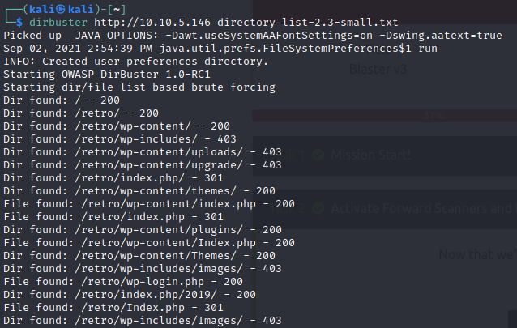
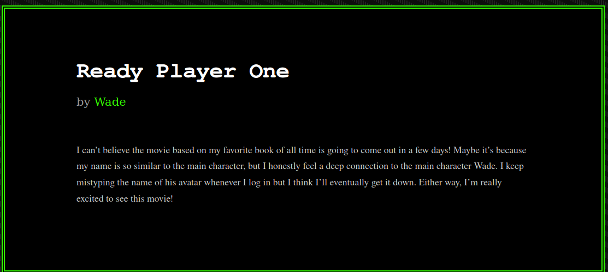

# Blaster TryHackMe room
## 1. Recon
to find out the services running on the victim system
```
sudo nmap -sV <victim ip> -Pn
```
we find a web server running on the 3389 port
 <br>
when we access the IP from our browser, we get a windows IIS server landing page <br>
we go ahead and fuzz this URL to find any important paths to this IP
 <br>
we find a path /retro. when we navigate to this path, on the second last post of the page, we find something interesting
 <br>
a google search reveals that the username of the protagonist in the move "ready player one" is "parzival" <br>
## 2. Gaining access
when we access the wordpress login portal (/retro/wp-login.php), using the credentials "wade" and "parzival" works. <br>
we move ahead and try to log into the msrdp protocol using the linux package "remmina" using the credentials found earlier <br>
and voila! we are able to log into the machine and access the file "user.txt" and extract the text in it.
## 3. Privilege escalation
while accessing the machine through RDP, I found another executable called hhupd. a simple google search reveals that the executable has a vulnerability with a CVE ID "CVE-2019-1388" <br>
the way to exploit this vulnerability is pretty straight forward.
1. right click hhupd.exe and click on run as administrator.
2. click on more options and then view certificates
3. there will be a hyperlink provided in the certificate window, click on that
4. this will open the browser as administrator. now, we have to open a shell as administrator.
5. for this, in the IE window, go to file -> save as. a file explorer will be spawned. navigate to C:\Windows\System32 and open cmd from there.
6. we have successfully spawned a shell with administrator privileges. <br>
we can now go ahead and read the root.txt file and then proceed by doing all the other steps mentioned in the room to spawn a meterpreter session.

with this we clear the room.<br>
