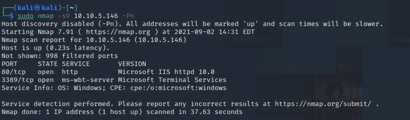

# Blaster TryHackMe room
## 1. Recon
to find out the services running on the victim system
```
sudo nmap -sV <victim ip> -Pn
```
we find a web server running on the 3389 port
 <br>
when we access the IP from our browser, we get a windows IIS server landing page <br>
we go ahead and fuzz this URL to find any important paths to this IP
 <br>
we find a path /retro. when we navigate to this path, on the second last post of the page, we find something interesting
 <br>
a google search reveals that the username of the protagonist in the move "ready player one" is "parzival" <br>
## 2. Gaining access
when we access the wordpress login portal (/retro/wp-login.php), using the credentials "wade" and "parzival" works. <br>
we move ahead and try to log into the msrdp protocol using the linux package "remmina" using the credentials found earlier <br>
and voila! we are able to log into the machine and access the file "user.txt" and extract the text in it.
## 3. Privilege escalation
while accessing the machine through RDP, I found another executable called hhupd. a simple google search reveals that the executable has a vulnerability with a CVE ID "CVE-2019-1388" <br>
