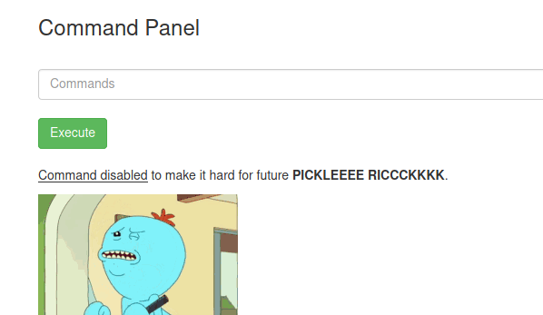

# Pickle Rick TryHackMe Room
## 1. recon
```
nmap -sV 10.10.197.37
```
<br>
we see that there is an apache server running on the machine. once we access it through our browser, we get the following webpage:
<br>
lets look at the source code of the webpage. we see a comment that will be helpful to us:
<br>
since there is a web server, the only logical thing to do is to fuzz it. so we run dirbuser and use the "directory-list-2.3-small.txt" directory. <br>
following are the results of the fuzzing:

bingo! we found a login portal.
## 2. breaking in
 <br>
we will try to bypass this login portal. <br>
running SQLmap suggests that this portal is not vulnerable to SQL injection. <br>
bruteforcing it with hydra did not yield any interesting results either (i accidentally left it running for 5 hours XD) <br>
I decided to look in another direction at this point. fuzz results had included the robots.txt. when accessed, it just contains the string "Wubbalubbadubdub". <br>
<b>plugging the username we discovered earlier and the infamous string we just discovered into the login portal logged us in with no trouble </b>
 <br>
all the other tabs in the portal contain the same content:<br>

The commands tab seems to be executing commands on the machine<br>

running the ls command shows us that there is a fine of our interest in this directory:
<br>
but we are unsuccesful when we try to read the file using the cat command. <br>
<br>
lets have a look at all the binaries installed in the system (in the /usr/bin directory)<br>
an interesting binary is the less binary, which also lets us read the contents of a file. when tried accessing the file with that command,
<br><b>it works. we find our first secret!!</b><br>
lets look at the contents owned by the user "rick" (in the directory /home/rick). we see one file named "secret ingredients".
<br><b>running the less command easily reveals its secret!!</b>